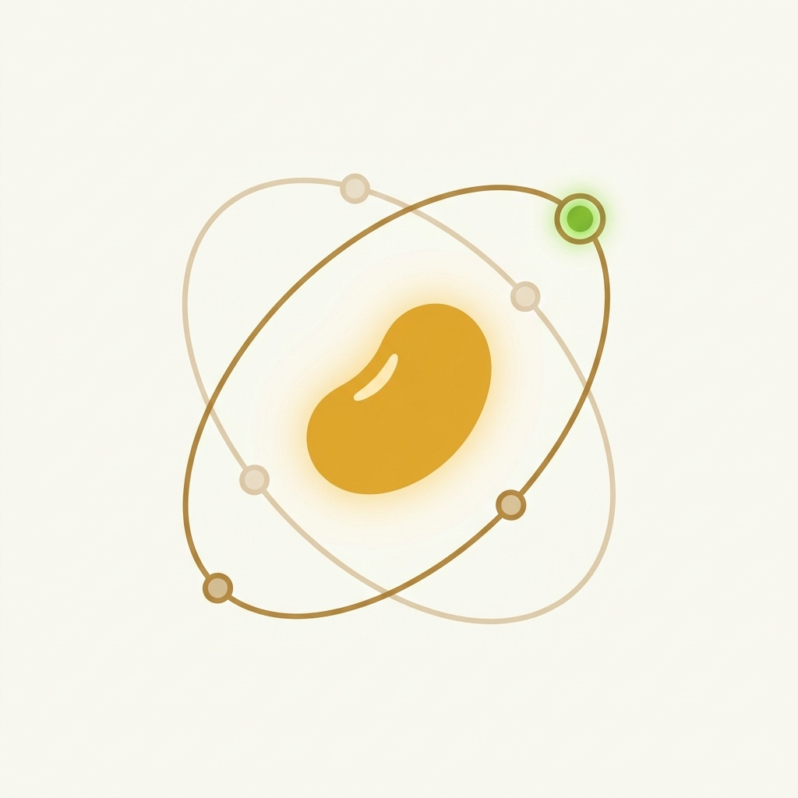

<p align="center">
  
</p>

# docs

Legacy source for **[docs.soyaos.ai](https://docs.soyaos.ai)**. Public
documentation now lives at `https://soyaos.ai/<locale>/docs/...`; this
Cloudflare Pages project preserves old links with path-aware permanent
redirects from `static/_redirects`.

We chose Docusaurus over Mintlify because the toolchain is open-source —
we want anyone to be able to spin up a private fork of this site without
paying a vendor.

## Seed content

| Page                | Path               |
| ------------------- | ------------------ |
| Quickstart          | `docs/quickstart.md` |
| Architecture        | `docs/architecture.md` |
| Editions            | `docs/editions.md` |
| SoyaPack v0 manifest | `docs/soyapack-v0.md` |
| CLI v0 reference    | `docs/cli-v0.md`   |

## Local dev

```bash
bun install
bun run dev          # http://localhost:3000
```

`npm install && npm run dev` also works if you don't have Bun.

## 中文 Quickstart

SoyaOS 官方文档站，Docusaurus 3 构建。本地：

```bash
bun install
bun run dev          # http://localhost:3000
```

构建产物在 `build/`。中文文档放在 `i18n/zh-Hans/` 下（待补）。

## Deployment

- **Production**: Cloudflare Pages, custom domain `docs.soyaos.ai`.
- **Build command**: `bun run build` (or `npm run build`).
- **Output directory**: `build/`.
- **Canonical owner**: `soyaos.ai`; `docs.soyaos.ai` is redirect-only.

## Deploy

`main` is auto-deployed to the Cloudflare Pages project `soyaos-docs`
by `.github/workflows/deploy.yml` on every push. The custom domain
`docs.soyaos.ai` is bound to that Pages project via the Cloudflare
dashboard (CNAME `docs` → `soyaos-docs.pages.dev`, "Always Use HTTPS"
enabled).

Required repo secrets (Settings → Secrets and variables → Actions):

| Secret                  | Notes                                                     |
| ----------------------- | --------------------------------------------------------- |
| `CLOUDFLARE_API_TOKEN`  | Pages:Edit (least privilege).                             |
| `CLOUDFLARE_ACCOUNT_ID` | Cloudflare account that owns the Pages project.           |

Rollback: `wrangler pages deployment list --project-name=soyaos-docs`
and promote a previous deployment from the dashboard.

## License

[MIT](./LICENSE) — © 2026 SoyaOS Contributors.
